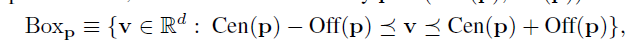
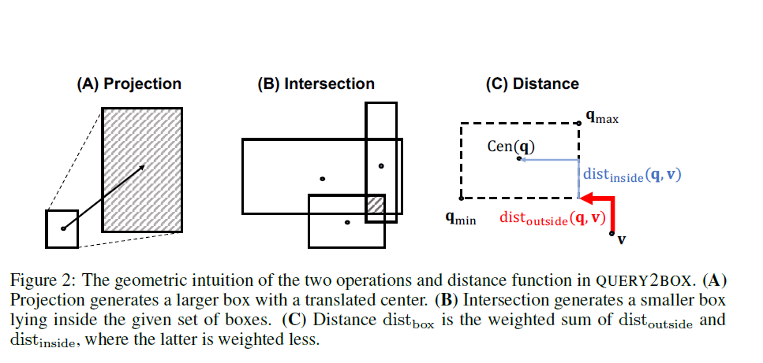
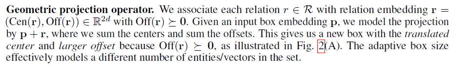
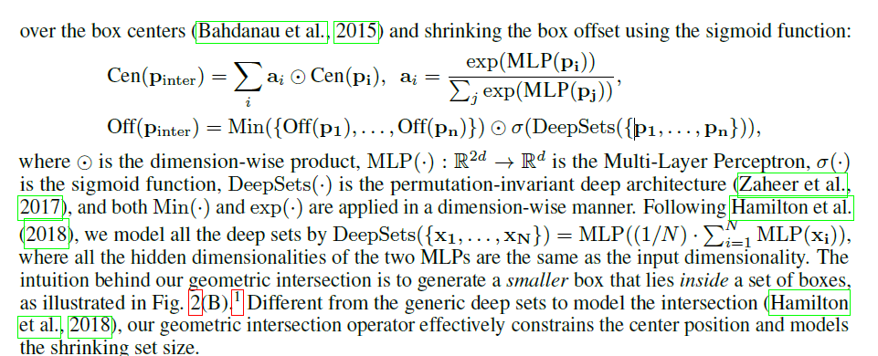

# 《Query2box: Reasoning over Knowledge Graphs in Vector Space Using Box Embeddings》

作者：H Ren, [W Hu]

代码：[【Aminer】https://github.com/hyren/query2box](https://github.com/hyren/query2box)，[KGReasoning](https://github.com/snap-stanford/KGReasoning)

数据集：[FB15k,FB15k-237,NELL](https://github.com/hyren/query2box/tree/master/data)

理解参考：[知识图谱推理论文阅读（三）](https://zhuanlan.zhihu.com/p/453548347),[当可解释人工智能遇上知识图谱](https://jishuin.proginn.com/p/763bfbd61ae1)，[知识图谱推理论文阅读（三）](https://zhuanlan.zhihu.com/p/453548347)

**问题**：

+ **之前的工作将查询建模为向量空间中的单个点，这是有问题的**，因为一个复杂的查询表示它的答案实体是一个潜在的大集合
+ 之前的工作只能处理使用合取(∧)和存在量词(∃)的查询。用析取(∨)处理查询仍然是一个问题

**贡献**：

+ 提出QUERY2BOX, 将基于嵌入的框架推理使用在在任意查询∧,∨,∃不完整的知识图谱上
+ 将query  embedding as boses(hyper-rectangles) ,在盒子里面的点集对应一组结果

**如何表示一个Box**

​				define a box by $p = (Cen(p),Off(p)) \in \R^{2d}$

其中$Cen(p) \in \R^{d}$为盒子中心，$Off(p) \in \R^d _{\geq0}$为盒子的正偏移，表示盒子的尺寸大小。每个entity被表示成尺寸为0的盒子。

**投影算子（projection）**

​                    **问题**：经过投影后，盒子的尺寸变大，但有些`关系(relation)`可能会导致尺寸减小

**合取算子（intersection）**

 					**问题**：DeepSets的作用是什么，DeepSets公式中的MLP(1/N)有什么用，为什么不直接$\times 1/N ?$

​										查看论文Deep Sets

**实体和查询盒子间的距离（Entity-to-Box distance）**

**loss function**：

​				负采样：与BetaE的损失函数相同，只是重新定义了实体和query之间的距离

**析取算子的处理**：转换为合取范式

​						按照先前的方式定义合取算子时，由于Box 在空间中的任意位置，将导致合取后的空间不封闭？

​                     [文中证明，若将析取也定义成与合取类似的逻辑向量操作的情况，那么生成的不同问题数量跟知识图谱的实体数目是成正比的，这将使模型很难泛化到大规模知识图谱中。所以文中提出将问题转换成一种由多个合取所组成的析取范式框架(Disjunctive Normal Form)，将析取定义成对所有合取结果的最后一步合并操作，如下图](https://new.qq.com/rain/a/20200506A08QQM00)

​                    [对于析取操作（就是并集），大家可以想到，并集后的元素或者空间一般都是越来越大的。这样的话，如果后面再有其他的操作，计算成本就会更很多。而他们想出了一种优化方法。根据逻辑命题的范式存在定理，其实对应任何的公式，都能够找到等值的CNF和DNF。这里转换为DNF，也就是说所有的析取操作（并集操作将推到最后才进行）。如下图，这里就进行DNF转换，让并集操作在最后计算。](https://jishuin.proginn.com/p/763bfbd61ae1)

学习内容：**《离散数学》**析取范式和合取范式

**Theorem 1 没太看懂 VQAQ！**

