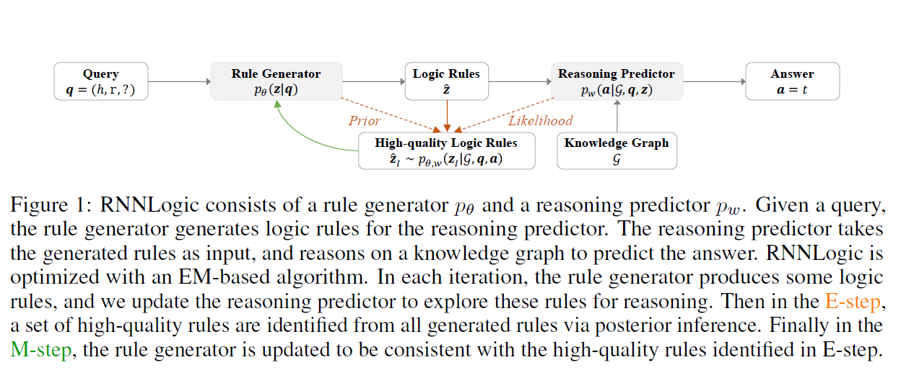
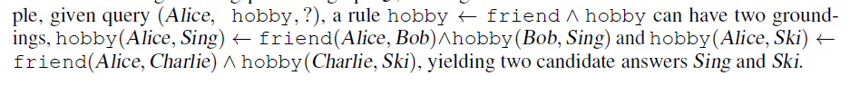
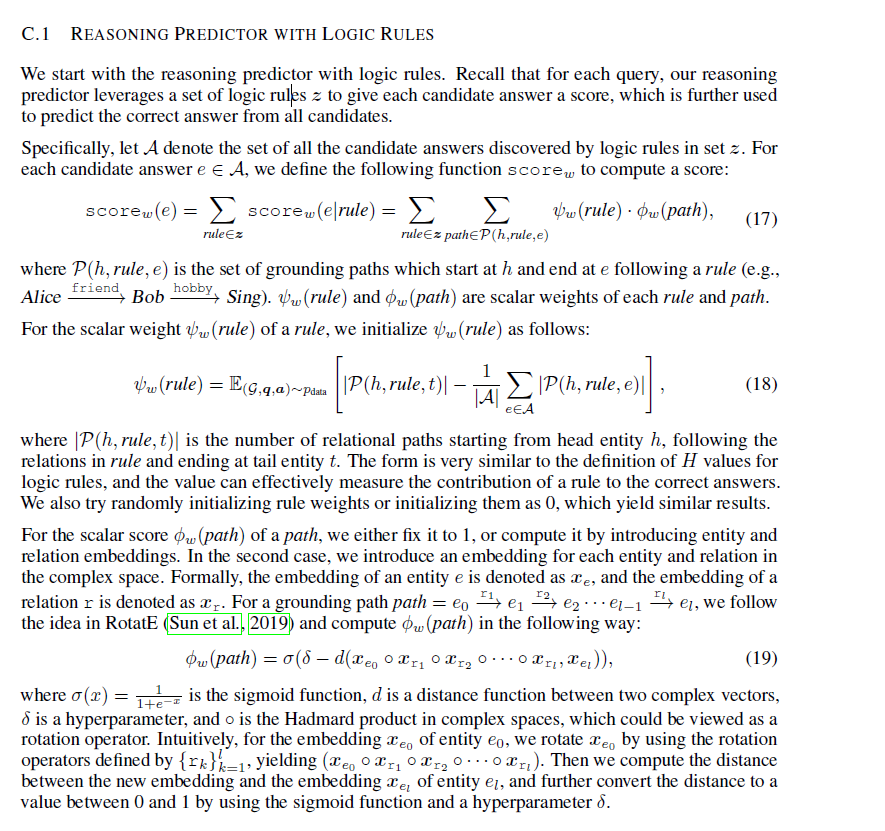
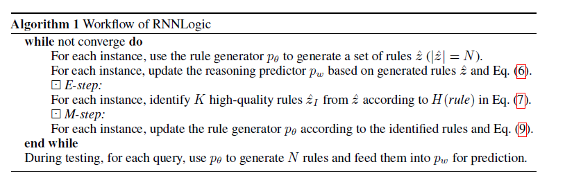

# 《RNNLogic Learning Logic Rules for Reasoning on Knowledge Graphs  》

作者：Meng Qu , Junkun Chen , Louis-Pascal Xhonneux , Yoshua Bengio, Jian Tang

数据集和代码：[RNNLogic](https://github.com/DeepGraphLearning/RNNLogic)

背景介绍、相关方法的不足、大致方法介绍可以参考：[基于逻辑规则的图谱推理](http://k.sina.com.cn/article_2674405451_9f68304b019010z8y.html?sudaref=www.baidu.com&display=0&retcode=0)

思考：在训练预训练语言模型的时候，能够加入逻辑规则？

**挑战**：

+ 传统方法（路径排序、马尔可夫网络）将图中的关系路径作为候选逻辑规则，然后学习每个规则的权重，还有一些基于神经逻辑编程和神经定理器方法，能够以可微分的方式同时学习逻辑规则及其权重，但这些方法的搜索空间是指数级的，难以识别高质量的逻辑规则。
+ 还有一些方法将问题公式化一个顺序决策过程，并使用强化学习来搜索逻辑规则，然而由于动作空间太大，奖励稀疏，性能不是太好

**贡献：**

+ 提出一个RNNLogic的概率模型。RNNLogic将逻辑规则作为潜在变量，同时用逻辑规则训练规则生成器和推理预测器。
+ 提出了一个基于EM的优化算法，在每次迭代过程中，对推理预测器进行更新，探索逻辑生成的逻辑规则。在E-step中，利用规则生成器和推理预测器，通过后验推理从所有生成的规则中选择一组高质量的规则;在M-step中，规则生成器用在E-step中选择的规则进行更新。

**问题定义**

​		给定QUery: $q=(h,r,?)$; answer: $a=t$; 知识图谱$G$，求解目标分布$P(a|G,\ q)$

**模型：**

✔**问题：**规则生成器如何生成规则？逻辑规则的表现是怎么样的？

​        在生成规则的过程中，只考虑关系$r$而不考虑插叙的实体$X$，需要生成的规则组合为：$[r,r_1,r_2,...r_l,r_{END}]$， 其中查询关系$r$为规则头，$\{r_i\}_{i=1,..}^l$为规则体，$r_{END}$为规则尾，使用RNN对规则的生成过程进行建模，则:
$$
p_{\theta}(z|q) = Mu(z|N,RNN_{\theta}(\cdot|r))	
$$
​		$z$为 a set of rules，$Mu$表示多项式分布，$N$表示集合$z$的大小，$RNN_{\theta}(\cdot|r)$表示规则头为$r$上的分布

​	**问题**:通过RNN生成规则，那么对于规则头$r$，但训练过程中，对于相同的模型参数，每次只会生成一个规则集合，但在论文中会生成多个规则集合，这是如何做到的？

​		

✔**问题：**推理预测器如何计算每个规则的分数？若$A$为空怎么办？不存在为空的情况

​		推理预测器求解：$p_w(a|G,q,z)$，$A$表示任意逻辑规则都能推理出的答案，对于answer $e \in A $, 

> Let A be the set of candidate answers which can be discovered by any logic rule in the set z.
>
> Specifically, let A denote the set of all the candidate answers discovered by logic rules in set z.
>
> A 应当表示任意候选实体，而不是任意规则集合都能推理出来的实体

​						$$score_w(e)= \sum_{rule \in z }score_w(e|rule) = \sum_{rule \in z} \sum _{path \in P(h,rule,e)} \psi（rule）\cdot \phi(path)$$

**优化方法**

​		没太看明白，建议补充**EM算法**相关内容，不太了解整个模型是怎么训练的

**RNNLogic+**

后续补充...

​		

