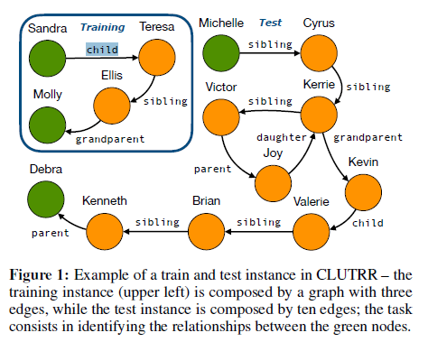

# 《Learning Reasoning Strategies in End-to-End Differentiable Proving》

作者：P Minervini, S Riedel, P Stenetorp，Edward Grefenstette， Tim Rocktäschel

代码：[uclnlp/ctp](https://github.com/uclnlp/ctp)

数据集：[CLUTRRS](https://github.com/facebookresearch/clutrr) Countries、Kinship、Nations、UMLS(在代码中存在)

参考：[神经+符号知识推理论文浅读4篇](https://blog.csdn.net/zy181234/article/details/125547487)

**挑战**

+ 神经网络与基于规则的系统融合，使得模型具备可解性，鲁棒性、data efficient, 但存在计算复杂性高（computational complexity ），搜索空间大的问题

**贡献**

+ 在NTPS（Neural Theorem Provers）的基础上，提出CTPS（Conditional theorem Provers），学习一个优化的规则选择策略。

## **1.问题定义**

参考论文NTPS

## **2.End-to-End Differentiable Proving（端到端的可微证明）**

这里的可微可以理解成可细分的，即可以将一个规则细分为多个规则

✔**问题1**:backward chaining （BC）是什么？反向传播链？

从目标（goal）反推，通过规则链寻找支持事实的证据。所以backward chaining 指从目标反推，支持事实的规则链

> NTPS:this algorithm works backward from the goal, chaining through rules to find known facts supporting the proof.

给定一个查询或目标$G$，首先在给定知识图谱中进行事实匹配（可以理解为1 hop?），如果失败，则考虑所有的规则$H:-B$，$H$表示结果，$B$表示前提。

✔问题2：如何理解?

> H can be unified with the query $G$ resulting in a substitution for the variables contained in H

$$
KB(knowledge\ Base) = \{facts,rule\},\ facts = \{p(RICK,BETH) ,\ p(BETH,MORTH)\},\ rule=\{g(X,Y):-p(X,Z),P(Z,Y)\}
$$

$p$ 表示关系$parent$, $g$表示关系$grandparent$。目标$G=g(RICK,MORTY)$能够通过规则$g(X,Y)$证明，即：将$X$使用$RICK$替换，即将$Y$使用$MORTY$替换，之后递归证明子目标：$p(RICK,Z),p(Z,MORTY)$,将$Z$使用$BETH$进行替换。

✔问题3：如何理解Neural Theorem Provers？

参考NTPS(End-to-End Differentiable Proving)

## **3.Conditional Proving Strategies**

### 3.1Differentiable Goal Reformulation（目标细分）

NTPS使用一个固定 规则集将目标细分，不适合大型数据集，因此提出：基于神经网络动态生成最小规则集

以下来源:[神经+符号知识推理论文浅读4篇](https://blog.csdn.net/zy181234/article/details/125547487)

> 本文提出的基于CTP（条件定理证明器）的选择函数select构建方法：将select以神经网络形式表述，输入的元素是向量化的查询目标G=[谓词向量，实体1向量，实体2向量]，生成向量化的规则H:-B，其中H是[谓词向量，变量1，变量2]，H中的谓词向量表示要与目标G中的谓词向量匹配。下面本文提出了三种构建select模块的方法：

### 3.2 Neural Goal Reformulation

定义select 为一个线性函数：

$F_H(G) = [f_H(\theta_{G_1}),X,Y],\ F_{B_1}(G) = [f_{B_1}(\theta_{G_1}),X,Z],\ F_{B_2}(G) = [f_{B_2}(\theta_{G_1}),X,Y]$

### 3.3 Attentive Goal Reformulation

以下来源:[神经+符号知识推理论文浅读4篇](https://blog.csdn.net/zy181234/article/details/125547487)

> 这里本文和GNTP的学习规则优化方法有一个非常相似的考虑，即将已知的谓词集合花体R考虑进来，通过设计注意力机制，生成注意力分布,可以大幅缩小参数规模，尤其是在嵌入表示维度远大于已知谓词集合规模的时候。只不过GNTP是直接在学习谓词表示的嵌入函数上作改进，本文是在选择函数上做改进。

$E_R$表示所有关系的表征

### 3.4Memory-Based Goal Reformulation

理解：生成规则头时，$M_1$表示所有的规则头的表征，生成规则体的第i关系谓词时，$M_i$表示所有规则体的第i多个表征。与attentive Goal 的不同，考虑了关系谓词在不同的规则中的位置对关系谓词表征的影响，个人感觉关系不大。

以下来源:[神经+符号知识推理论文浅读4篇](https://blog.csdn.net/zy181234/article/details/125547487)

> 将规则储存为记忆矩阵[M1,…,Mm]，每个Mi表示n个规则的第i个谓词。
> 这里没有说明下标m的意义，只说每个-Mi表示n个规则的第i个谓词，且Mi的维度是n*k。我的理解是，每个Mi包含所有n个规则的第i个谓词的表示，而每个规则含有的谓词数量并不一定相同，可能会出现Mi到后面出现较多空行。

✔问题：无论那种规则，在$select_{\theta}(G)$时，生成的都是规则表征，然而在整个算法迭代的过程中，无法增加新的实体，即生成的规则中都是$X,Y,Z$的变量，而没有产量，那么常量从哪里来？即无法生成**ground rule**？

从原文中可以看出，给定一个查询，每次首先对fact 进行unify，如果匹配失败，在考虑所有的规则。在上面的伪代码中，忽略了这一步，直接对所有的规则进行匹配。

在大型知识图谱中，当fact的数量很多时，将导致模型的速度变慢。个人感觉基于符号的推理方法只能在小知识图谱中进行应用，在大型知识图谱上运用需要克服太多困难

### 4 Experiments

问题：如何理解图中的story

 

**K**和**story**是一个东西，表示训练集中边的数量

