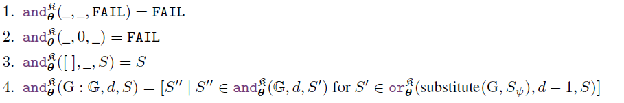

# 《End-to-End Differentiable Proving》

作者：T Rocktäschel, S Riedel

代码和数据：[uclnlp/ntp](https://github.com/uclnlp/ntp)

数据集：Countries、Kinship、Nations、UMLS，SYNTH，NTP(在代码中存在)

数据集介绍：

以下内容出自[神经+符号知识推理论文浅读4篇](https://blog.csdn.net/zy181234/article/details/125547487)：

> Countries知识库：包含244个国家，5个大洲，23个子区域（比如西欧，东欧这种），1158个关于neighbor关系和Located关系的facts。
> Kinship：26个谓词关系，104个常量实体，10686个facts。
> Nations：56个双向谓词，111个单向谓词，14个常量实体，2565个facts。
> UMLs：49个谓词关系，135个常量实体，6529个facts。

参考文档：[神经+符号知识推理论文浅读4篇](https://blog.csdn.net/zy181234/article/details/125547487)

## 1.符号定义

以下内容出自[神经+符号知识推理论文浅读4篇](https://blog.csdn.net/zy181234/article/details/125547487)：

> **Atom**：类似三元组，[grandfatherof,Q,BART]，包含一个关系谓词predicate、两个实体items。
> **Predicate**：关系谓词，例如parentof
> **Items**：实体，包括变量实体（如Q）和常量实体（如BART）。
> **Rules**：H:-B。B表示规则主体，是一系列atoms组成的列表；H是单个atom，表示“头规则”。
> **ground rule**：没有自由变量的rule。
> **fact**：只有头规则的rule，即B为空，且不含变量。
> **涉及序列的“：“**：用冒号表示一个序列中预先设定的元素，例如e:E表示实体列表E中一个实体e。
> **证明状态S**：由替换集合$S_{\psi}$ 和证明分数$S_{\rho}$ 组成。替换集合$S_{\psi}$的形式为{变量/实体，变量/实体，…}，表示将一个实体（有可能是变量有可能是常量）配置到变量上。

小写表示关系谓词和常量实体，e.g. fatherof, BART 

大写表示变量 e.g. X, Y , Z

查询或目标 $G$ e.g. $[grandfatehrof ,Q,BART]$

KB (用花体R表示)：Knowledeg Base

## 2.可微证明器（Differentiable Prover）

整个算法的理解：

**function or()**用来遍历KB(Knowledge base)中的规则，**function unity()**用来计算目标$G$和头规则之间的相似性，同时更新$S=(s_{\psi},s_{\rho})$，**function and()**通过调用**or()**来将规则体$B=[B_1,B_2],\ B_i=atom$中的$B_1,B_2$分别使用其它规则替换，最终实现将变量实体全部使用产量实体替换。在**unify()**中，禁止使用same non-ground rule twice.

### 2.1 Unification Module

输入：$H,G,S$

作用：更新替代集$S$；在$H,G$中没有变量的情况下，使用神经网络计算两者之间的相似性。that "_" matches every argument

 $S'$ refers to the new proof state, $\nu$ refers to the set of variable symbols,and $\theta_g$: denotes the embedding lookup of the non-variable symbol with index g.

✔问题：如何理解替代集$S$的更新过程？

在KB(Knowledge Base)中，存在大量fact和non-ground rule，只有$H$,$G$中没有变量时，才能更新替代集$S$,否则返回原来的替代集

### 2.2 OR Module

应用**KB**中的所有规则对$G$进行替代，即求解一个规则链来证明$G$成立。

### 2.3 AND Module

将规则体中的每一个$B_i$，当成查询或目标$G$，调用$or()$函数对$G$进行求解

### 2.4 Example

### 3.Optimization

**ground atom**:没有变量的三元组

**Know grouob atom**:正确的三元组，在论文中可以理解为正确答案

**corrupted ground atom**：作者进行采样，得到的错误的三元组，用以进行训练

$\tau$:表示一个同时包含正样本和负样本的集合，其中正样本的目标分数(y)为1，负样本的目标分数(y)的0.

损失函数为：

在训练过程中，mask了直接导致查询为真的fact

> during training we are masking the calculation of the unification success of a known ground atom that we want to prove.

### 3.1 Neural Link Prediction as Auxiliary Loss

在训练的过程中，加入链接预测的辅助损失函数

原因：在训练的过程中，损失中的argmax score 将会导致梯度只沿着最最大分数路径进行反向传播，将NTPS需要很长时间才能学习到符号表征间的相似性。

> Moreover, as only the maximum success score will result in gradient updates for the respective subsymbolic representations along the maximum proof path, it can take a long time until NTPs learn to place similar symbols close to each other in the vector space and to make effective use of rules.

使用ComplEX 加速学习过程

待看 ComplEX

