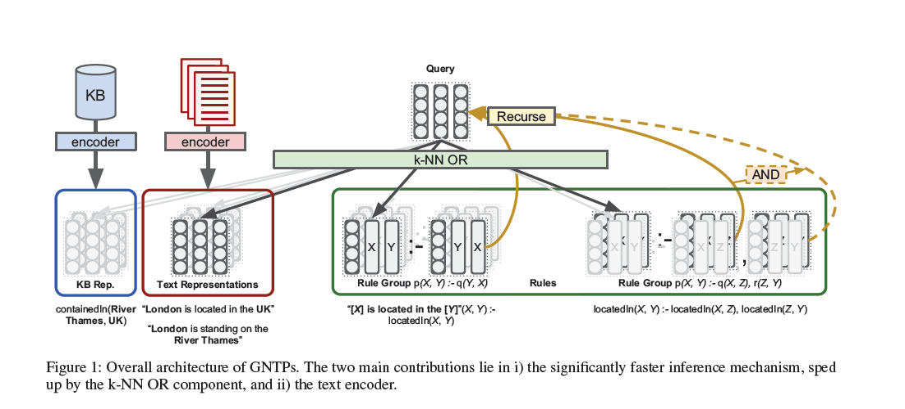

# 《Differentiable Reasoning on Large Knowledge Bases and Natural Language》

代码和数据：[uclnlp/gntp](https://github.com/uclnlp/gntp)

在上一篇《End-to-End Differentiable Proving(NTP)》的基础上，提出、

以下内容出自[神经+符号知识推理论文浅读4篇](https://blog.csdn.net/zy181234/article/details/125547487)：

> + 1.NTP中计算复杂度较高（or模块通过将目标与知识库中所有规则进行匹配计算，and模块要对规则主体中的每个子元组进行递归证明），因此NTP只能成功应用于涉及的数据集较小的任务，可扩展性较差。
> + 2.大多数人类知识在KB中是不可得的，但是在自然语言文本上直接进行自动推理又很困难的（可能因为自然语言文本一般是非结构化数据）

对于一个目标$G=[P,A,B]$，改进：

+ 针对$or()$ ,不是遍历所有规则，而是选择特定规则
+ 针对事实集$facts$，不是遍历所有的$fact$,而是选择合适的$fact$，通过采用最近邻检索（Nearest Neighbour Search）来选取最大的fact

## 1. Efficient Differentiable Reasoning on Large-Scale KBs

### **1.1Fact Selection**

以下内容出自[神经+符号知识推理论文浅读4篇](https://blog.csdn.net/zy181234/article/details/125547487)：

> NTP中虽然要计算目标G和每个知识库中头规则的相似性，计算量很大，但是用于选择证明路径的函数只返回证明分数最大的路径，本文考虑在训练过程中使用最大证明分数来计算证明分数对于参数的梯度，将给定目标G与知识库中facts的统一分数计算视为一个最近邻搜索问题。本文认为由于NTP的unify模块使用的是负欧氏距离单调变换的高斯核，和最近邻的计算原理可以相通。
> (相当于重新构建了一个unify模块，不通过高斯核学习嵌入表示进而进行计算，而是通过最近邻搜索来计算相似性进行选择）

### **1.2Rule Selection**

本文首先对知识图谱(花体R)中的$fact$和$rule$按照是否有相同的模板进行分类，然后在对比目标G与知识库时，不用考虑所有头规则，而是只考虑目标G最近邻集合中的头规则。

### 1.3learning to Atten Over Predicates

作者认为，对于$rule=H:-B，H=[\theta_{p:},X,Y],B=[[\theta_{q:},X,Z],[\theta_{r:},Z,Y]]$，模型中存在3个训练参数$\theta_{p:},\theta_{q:},\theta_{r:} \in \R^k$,但$k$很大的时候，很难训练。作者提出一种基于注意力权重的方法，将$\theta_{p:}$转化为$\theta_{p:}=softmax(a_{p:})^TR, R \in \R^{|R|\times k}$,$a_{p:}$表示与$\theta_{p:}$有关的注意力矩阵。

✔问题：如何理解known predicates?

是指在训练过程（知识图谱）中的已知的谓词，或者说常量谓词。简单理解就是基于注意力，用常量谓词表示变量谓词

个人感觉创新性不是很大，就是凑数的

## 2. Jointy Reasoning on Knowledge Bases and Natural Language

自然语言语料库和知识图谱联合推理

mentino(text surface)

> a mention is a textual pattern between two co-occurring entities in the KB (Toutanova et al. 2015), such as “LONDON is located in the UK”.

简单理解就是，首先获取$t=[[arg1],borders,with,[arg2]] $的表征，然后通过encode网络将维度映射到$\R^{|t| \times k^{’}}$，最后做了一个平均池化，但时文中没有说明文本表征和知识图谱的i保证是如何融合的。整个模型的结构如下图。

## 3.总结

以下内容出自[神经+符号知识推理论文浅读4篇](https://blog.csdn.net/zy181234/article/details/125547487)：

> 1.针对问题1，本文通过减少候选证明路径的数目、引入用于规则归纳的注意力机制，减小了NTP的时间和空间复杂度，提高了模型的可扩展能力。
> 2.针对问题2，本文通过使用端到端的可微模块，在共享的空间中联合嵌入谓词和文本表面模式（textual surface patterns，也即mention），实现了对自然语言文本信息的利用。