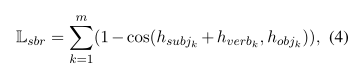

提出了SPIDER,为了模拟类似对话的特征，文章在原有的LM目标之外提出了两个训练目标。1）语序恢复，预测对话语境中被打乱的语序；2）句子骨干正则化，对模型进行正则化，以提高总结的主语-动词-宾语三要素的事实正确性。
    x = {[cls]r[sep]u1[eou] . . . [EOU]un[SEP]}， r是回应，u是对话中的所有语篇（一个对话上下文中有多个语篇）
    1）语序恢复，将随机洗牌的对话语篇组织成一个连贯的对话语境。预测一个顺序。
    2）句子骨干正则化，动机是引导模型区分从每个语料中提取的事实三联体的内部关系，提取每个句子中的主语动词和宾语提取出来，作为一个语篇的SVO三联体。
        文中假设，隐藏表示空间中，主语和动词的总和应该尽可能地接近宾语，即hsubject + hverb → hobject。Loss的计算如下
        
提出了两种训练方法
    1.训练后的总体损失是MLM、NSP、UOR和SBR损失之和。（Bert原有的任务和上述两个新任务）我完整模型是通过结合上述两个目标的联合损失来训练的。L = λ1(Lmlm + Lnsp) + λ2Luor + λ3Lsbr ，其中λ1, λ2, λ3是超参数。
    2.将上述两个任务当做下游任务来训练。（多任务微调）