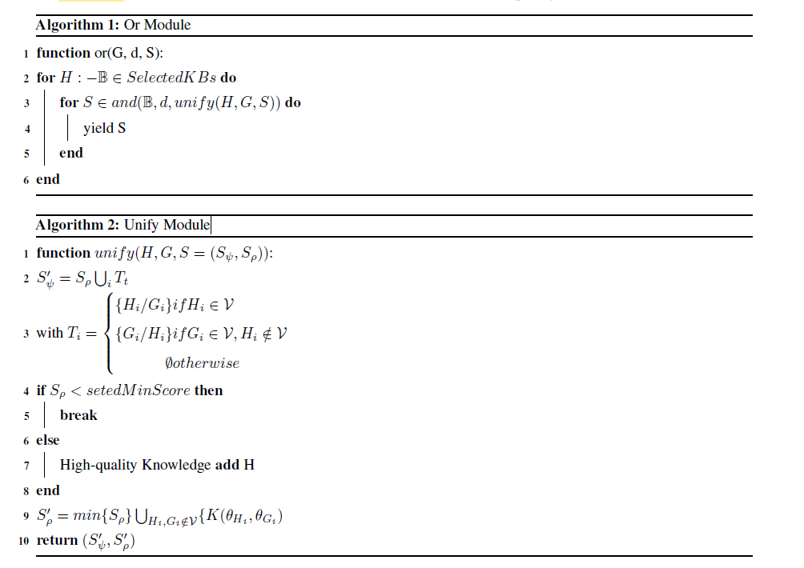
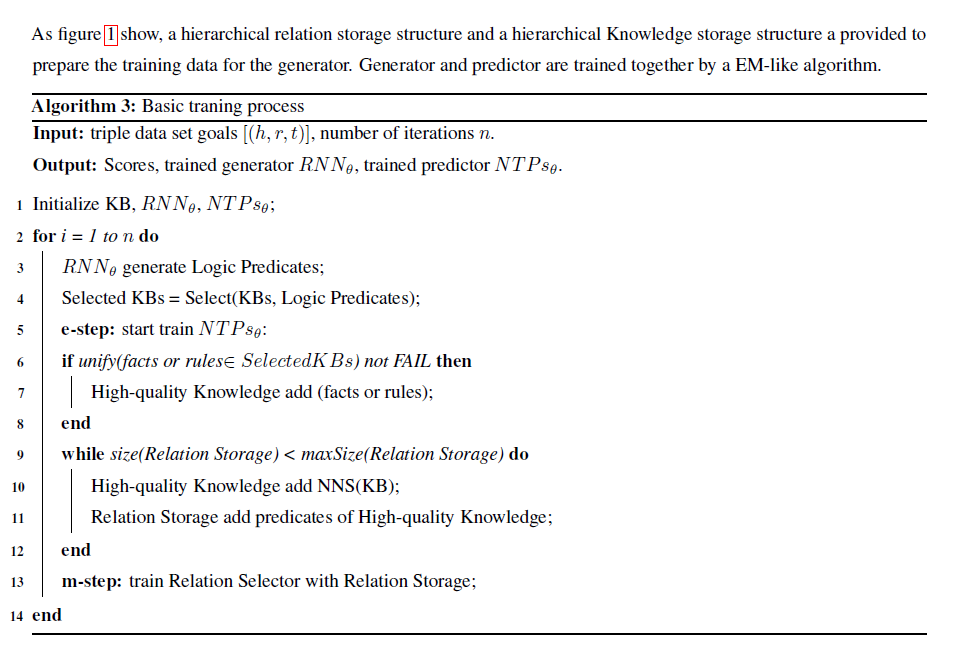
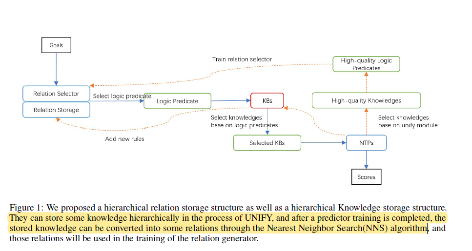
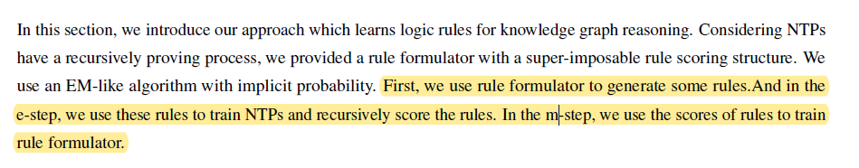
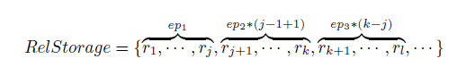
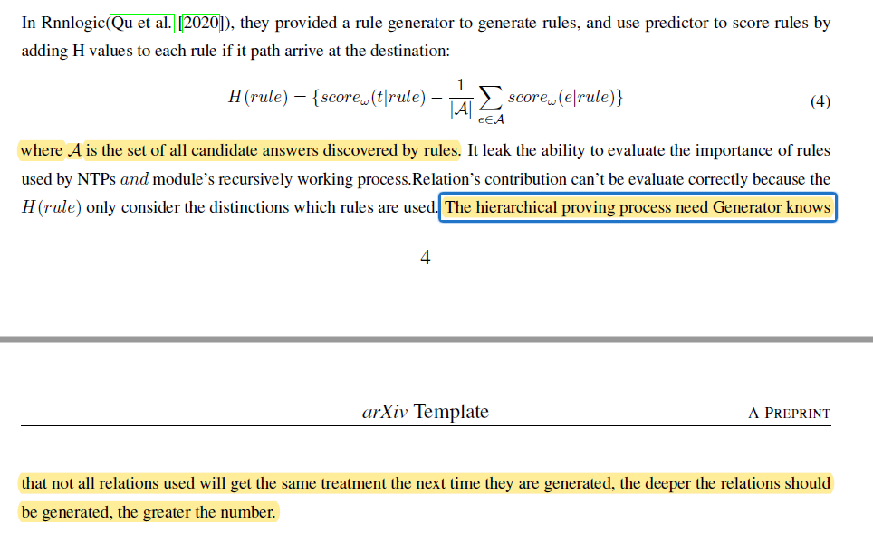

# 《Neural Theorem Provers Delineating Search Area Using RNN》

作者：Yu-hao Wu, Hou-biao Li

代码：无

数据集：[Kinship, UMLS, Nations and Countries](https://github.com/uclnlp/ntp)

贡献：

+ 在NTPs（Neural Theorem Provers）的基础上，提出一种RNNNTP的方法，使用基于EM的方法降低计算复杂性，提高计算效率

以下内容出自[神经+符号知识推理论文浅读4篇](https://blog.csdn.net/zy181234/article/details/125547487)：

> GNTP、CTP等优化NTP的方法中，使用的缩小搜索空间的策略的缺点是选择模块无法解释，且未通过专家知识帮助增强性能。这些方法均是通过添加神经网络层或参数来改善 NTP 表现（主要是在大规模数据集上），但缺乏使用领域知识来增强它的能力。
> 尤其是CTP（本文主要针对CTP中存在的问题），本文认为CTP中提出的三类方法并没有给出令人信服的理由来解释为什么要将目标谓词关系通过这样三种看上去不具备可解释性的函数处理（线性、两种注意力）。

**Super-imposable rule**：

## 1. EM-like Optimization with Hierarchical Relation Generator

### 1.1Relation Generator

✔问题：如何理解？

> if $unify$ succeeds in the proof process, then the rules and  facts traversed by the operation are the same as the previously traversed rules and facts are related, and the related  relationship is sequential....Therefore, the sequence relationship between our upper-level rule facts and lower-level rule facts is universal

the related  relationship is sequential. 可以理解为关系之间是序列化的，如下列中的$grandpaOf \leftarrow fatehrOf \leftarrow sonOf,grandpaOf$;

如果在$unify$ module中证明了谓词（predicate）之间具备很高的相似性,这可以说明，当前被递归的规则和先前递归的规则是一致的（结合上下文，这里的一致可以认为在递归中，rule的表征是一致的），$fact$是相关的。

原文示例： 当我们要证明$grandpaOf$时，扩展 $grandpaOf \leftarrow fatherOf,parentOf$，当我们要证明$fatherOf$,我们几乎不用规则2$fatherOf \leftarrow sonOf,garandparentOf$作为一个扩展。（感觉后面这个不使用规则$fatherOf \leftarrow sonOf,garandparentOf$作为扩展，没什么用处，而且还会与后面的Therefore 造成因果混淆）

the sequence relationship between our upper-level rule facts and lower-level rule facts is universal

可以理解为在上级递归和下级递归中的rule和fact的表征能够传递下去的，并不需要对相同的rule在不同的递归深度的表征进行特殊处理，从而说明

原文首先说明了$rule$在不同的递归深度的表征是相同的，再解释了**Relation Generator**是如何构造的。

使用GRU生成下一个$r$，$h_t=GRU(h_{t-1},g([r_{t-1},r_t]))$，其中$h$表示隐藏层状态，$g$为全连接层，$r_t$表示relation(predicate)。

$r_{t+1}=softmax(o(h_{t+1}))$，文中没有说明$o()$是什么网络。每一个RNN生成的$r_i$都加入到关系集$LogicPredicates$中。

### **1.2Relation Storage**

定义一个与扩展系数（coefficient of expansion）集合$RelStorage$,并作为Relation Selector 的训练集

### 2. Predictor base on NTPs

与NTPs的不同：

+ $or()$模块只遍历relations generator 生成的rules
+ 在$unify()$中，设置$H$和$G$最小相似阈值，如何小于这个值，则直接中止；

## 3. Model Training

基于EM算法进行模型的训练。基本流程：

（1）**Generate Knowledge set：**$RNN_{\theta}$遍历目标中的每一个关系，生成一些关系集合$LogicPredicates$,之后再将$LogicPredicates$中关系和KB中的关系进行匹配，生成有一个知识集合（Knowledge set）$SelectedKBs$；

> $RNN_{\theta}$ traverses each relation in the goal, generates a series of relation sets. 这里goal 用了单数，可以理解为针对每个goal，用RNN递归生成关系集.

（2）**Training predictor $NTP_{s\theta}$**：，改进了$or()$ module, 当每次$unify()$成功时，都将当前的rule或者fact 加入到$qualityKnowledge$中；

（3）**High-quality Knowledge completion**：使用Nearst Neighbor Search(NNS) 搜索$qualityKnowledge$中的知识，并加入到Relation Storage中；

整个模型的训练过程如下图所示，使用EM算法是如何更新$Relation\ Selector$的？

首先$Relation\ Selector$生成一系列的rules和fact，构成$LogicPredicate$，然后与$KB$做匹配，形成$KBs$,针对每个KBs，执行NTPs，因为生成的LogciPredicate本来就是有序的，因此这里的NTPs可以简化成一直执行$unity()$,而不需要执行$and()$。

> performs each relationship in KB for each relationship in LogicPredicates matching,

问题：如何理解super-imposabe?

> we provided a rule formulator with a super-imposable rule scoring structure.

能否理解成超强规则，即高质量的规则，与下文的High-quality knowledge相对应？

问题：在算法3中，为什么需要基于**High-quality Knowledge**使用**NNS(KB)**构建一个$Relation\ Storage$？$NNS(KB)$的作用是啥？

首先$Relation\ Selector$生成是关系，然后通过与$KB$匹配生成$SelectedKBs$，这里匹配的意思可以理解成通过生成的关系去匹配$KB$中的rule和fact，例如relation $grandpaOf$ 通过匹配后得到 rule $grandpaOf:-fatherOf,parentof$和fact $grandpaOf,nameA,nameB$.

注意**High-quality Knowledge**中保存的是rule 或者fact，其对一个$unify()$计算得出的分数。$NNS(KB)$的作用是首先基于**High-quality Knowledge**在KB中检索相近rule或者fact，然后将其谓词（relation）加入到$Relation\ Storage$中，这样做个人感觉是扩大y的数量，同时保证输入样本数量和得到的数量一致？

但这样做存在一个问题就是$Relation\ Storage$是一个序列生成任务，经过$NNS(KB)$之后前后还存在关系吗？

从上述公式中可以看出，$Relation\ Generate$的生成的relation与标签应该是一对多的关系，但模型具体是怎么训练的还得查看代码。$Relation\ Generate$的损失函数应该与下面的类似：同时使用NNS(KB)感觉也与下面的相关。

