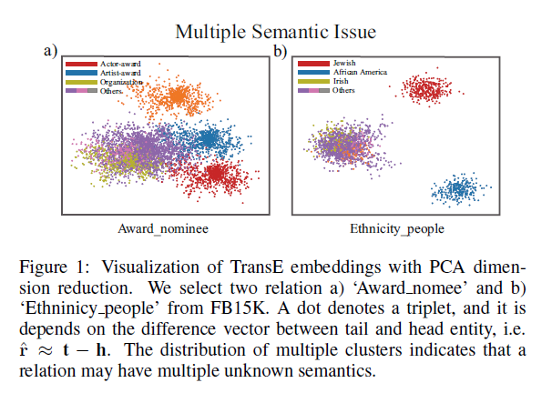
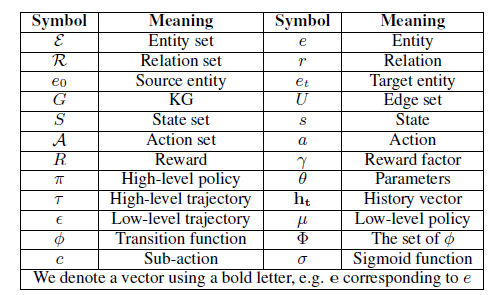
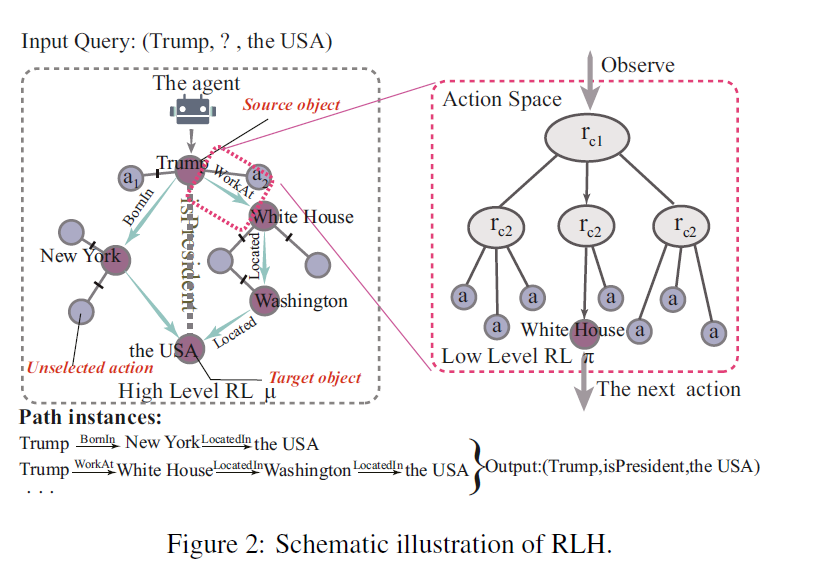
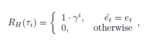
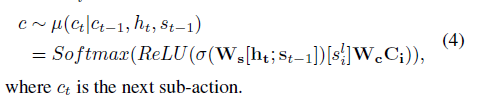
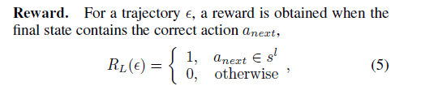
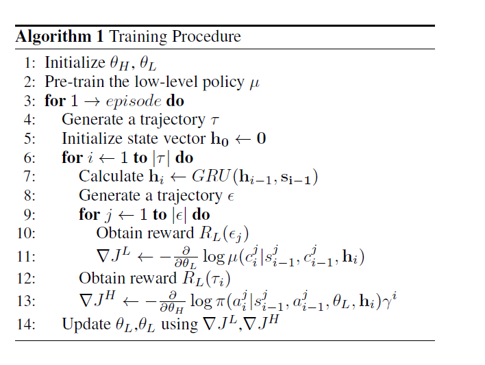

# 《Reasoning Like Human Hierarchical Reinforcement Learning for Knowledge Graph Reasoning》

作者：G Wan, S Pan, C Gong

代码：[kakarut/RLH](https://github.com/kakarut/RLH)

问题：

+ 由于多样和模糊语义，在大型知识图谱上进行多跳推理仍然是个挑战

一种关系存在知识图谱中存在多种语义，在下图中，一个点代表一个三元组，同一个图中所有的点具备相同的关系，其中a)表示relation *"Award_nomee"*，b) 表示relation *"Ethnicity_people"*，从图中可以看出一种关系存在语义。

贡献：

+ 在多跳推理中，解决了关系（relation）的一词多义问题
+ 提出了一个层次化的强化学习框架解决一词多义问题，该模型通过一个高层策略网络和一个低层的策略网络进行协同决策。其中，高层的策略网络负责学习推理过程中的序列信息。低层策略网络负责学习语义关系的层次信息。
+ 在知识图谱补全任务上，取得了竞争力的结果，在多语义问题上表现的更好

## 1.问题定义

**G**:$G=(\varepsilon,R,U)$

**KGR(Knowledge Graph Reasoning)**: 给定查询$(h,r,?),(?,r,t),(h,?,t)$，通过k-hop推理路径：$e_1 {r_1 \atop \longrightarrow} e_2 {r_2 \atop \longrightarrow} \cdot \cdot \cdot  {r_k \atop \longrightarrow } e_{k+1} $去预测 $?$.

**MDP (Markov Decision Process)**: $(S,A,P_a,R_a)$，$S$代表有限状态的集合，$A$表示有限的动作集合，$A_s$表示在状态s下能够执行的动作的集合.

​        $P_a(s,s')=Pr(s_{t+1}=s'|s_t=s,a_t=a)$    表示在$t$时刻，状态为$s$时，执行动作$a$，$t+1$的状态变为$s'$， $R_a(s,s')$表示状态变化后的实时奖励。

**Hierarchical Reinforcement Learning**: 可以看成一个**semi-MDP** $(S,A,P_a,R_{a,\Phi})$，$P_a(s,s')=Pr(s_{t+1}=s'|s_t=s,a_t=a)\prod _{i=1}^{K-1} Pr(\phi_{i+1}|\Phi _i)$,

> $\Phi$ is a transition function space to describe $K$ stages transiting inside the action a. Each $\phi$ is a sub-action of $a$. All of $\phi$ are relevant each other.

## 2.方法

### 2.1 Overview

本文提出一个层次化策略框架$\Phi=\{\phi _1,\phi _1,...,\phi _k\}$,在每一次交互动作时，智能体首先观察到一个动作空间$A$，之后通过$\Phi$选择最有可能的子动作.

> then it selects the most promising sub-action through  from $\Phi$ hypernymy concepts to hyponymy concepts.

在知识图谱环境中，动作空间是层次化的，因此复杂的动作空间能够被分解成子任务，就和一颗搜索树一样。因此多义关系可以被分解成更加清晰的表征。

### 2.2 High level Policy for Encoding History Information

这一部分主要定义了强化学习的基本要素，根据上一个实体、关系、当前实体，和目标实体，从可行的关系中选择一个关系。

**States**: $s_i = (e_{i-1},r_i,e_i,e_t)$，$e_{i-1},e_i$表示上一个实体和当前实体，$r_i$表示当前关系，$e_t$表示目标实体，开始状态用$('ST','ST',e_0,e_t)$，结束状态$(e_{t-1},r_t,e_t,e_t)$

**Actions**: 动作空间$A_{s_i}$为当前实体$e_i$的出度边的集合，$A_{s_i}=\{(r,e)|(e_i,r,e) \in G, e \notin \{e_0,e_1,...,e_t\}\}$

**Transition**: $P$根据当前的状态和动作，输出下一个状态的概率分布

**Policy**: 

​	hight-level policy network $\mu(s,A)=P(a|s;\theta)$，输入当前的动作和状态，输出动作表征

​	history vector information $h_t=GRU(h_{t-1},s_{t-1}),s_{t-1}=[e_{t-1};r_{t-1};e_t]$ 

​		注意：这里的$t$表示step $t$，并不是指代target $t$，还有**Policy**中的$s_{t-1}$与**States**中定义的$s_i$不一样，少了一个$e$，**Policy**中的应该是指**States**中的前3个元素

​	$a~\pi(a_t|s_{t-1})=softmax(W_{\pi}c)$,  $c$为低层策略网络 输出的子动作（relation cluster），$W_{\pi}$为关系矩阵，the array of $|R|$ matrices

**Rewards**:

​	$\tau _i$表示每一跳，如果推理成功，则按照上面的来，否证为0，对于多跳推理，最优最后一条才有可能获得奖励，中间推理过程无法判断是否成功

### 2.3Low Level Policy for Structured Action Space

低层策略网络主要是将复杂的动作空间$A_s$转化为结构化的子动作，其中状态空间是当前可行的动作集合，动作空间是已经聚类的relation clusters。论文对这一块的表述没有太详细，建议看论文原文

**Actions**: 首先基于TransE 获取表征，然后使用k-means将表征聚类，初始化成$C_1,C_2,...$,从而构建一个关系簇的层次集合。

**State**: $s^l$ 指包含当前有效子动作（sub-actions）的集合，对于一个trajectory $\epsilon$ ,开始状态为$A_s$，成功时的结束状态为$\{a_{t+1}\}$ ，否则为$\varnothing$

问题：状态$s^l$是如何更新的？

**Policy**: 但智能体获取到状态$s_i ^l$的sub-actions space时，有:

**Reward**: 

问题：如何理解search tree?和sub-actions？

> In this way, all states of the low-level RL are organized as a search tree. Thus the latent multiple semantics for each rela
> tionis well-expressed.

对于整个任务来说，寻找路径过程是一个搜索树，每一个action(relation)需要从当前的实体的所有出度边中进行选择，从而可以将任务分解成几个子任务，那么**Actions**中的关系簇的层次集合有什么用呢，和下面的优化M-length相矛盾，以及无法解释是如何解决多语义问题的，能不能理解成关系多语义问题被限定在了单个实体上，在单个实体中遇到的都是关系的单语义。

**个人错误理解：**

**Actions**: 首先基于TransE 获取表征，然后针对每一个关系$r$，作者首先求出所有的含有这种关系的三元组的集合$E_e=\{(h_1,r,t_1),(h_2,r,t_2),...,\} $，然后获取每个三元组中关系的表征$E_r=\{r_1=t_1-h_1,r_2=t_2-h_2,...\}$（不一定是相减求得关系表征），最后使用k-means聚类算法对$E_r$进行聚类分析，得到 $C_1,C_2,C_3,...,C_n\ where\ j$-th sub-action $  c_j^i \in C_i$，从而构建hierarchical sets of relaton clusters。

### 2.4 Optimization and Training

