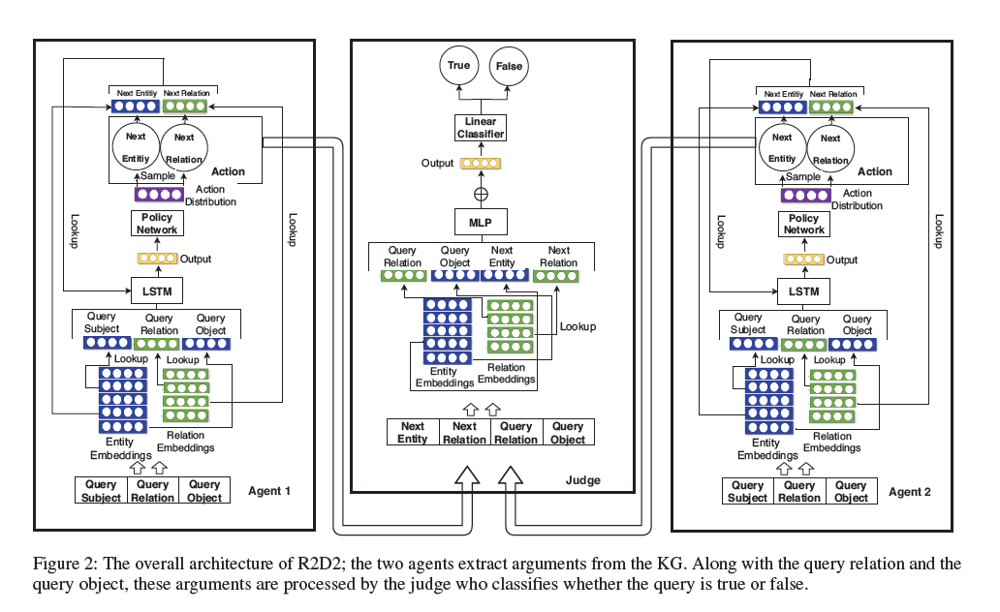
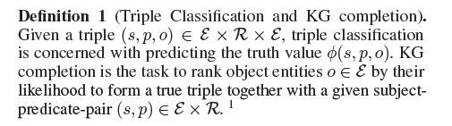
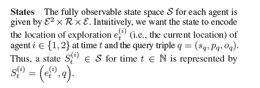
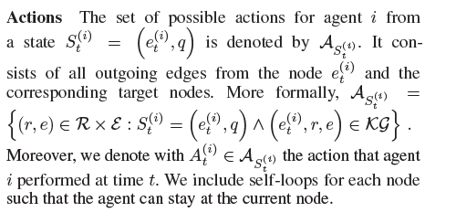
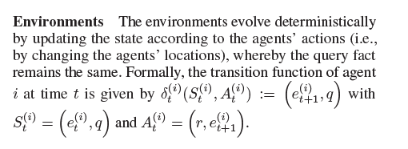
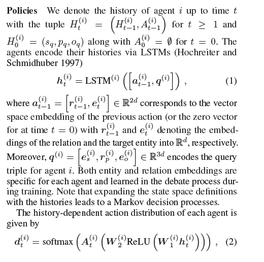
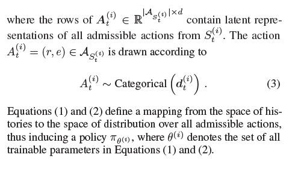
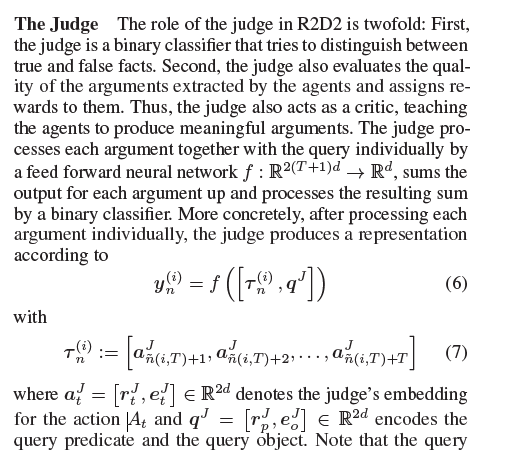
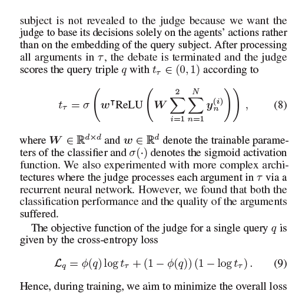
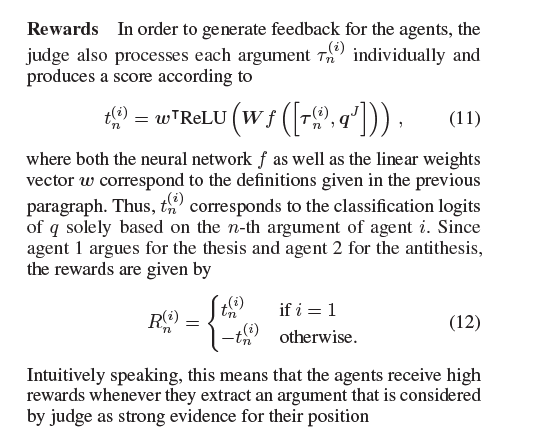

# 《Reasoning On Knowledge Graphs With Debate Dynamics》

作者：Marcel Hildebrandt, Jorge Andres Quintero Serna, Yunpu Ma

代码和数据：[FB15k-237, WN18RR, and Hetionet；code: R2D2](https://github.com/m-hildebrandt/R2D2)

理解：状态空间、动作空间太大，只能在小知识图谱上使用

**动机**：很多机器学习的任务都是通过将节点与关系嵌入，并计算三元组置信度得分，然后最大化正例的得分得到嵌入向量，但究竟哪一部分对最终的得分起作用是难以解释的。

**贡献**：提出一个基于动态辩论的知识推理模型，基于强化学习构建两个智能体，分别生成三元组为true 或false的路径，使用判别器判断是否为真或假。

**模型**

**问题定义**

**状态空间**

**动作空间**

**强化学习环境**

**policy**

选择下一个节点

**Judge**

判别器由两部分组成，第一部分是二分类器，第二部分用于评价论据的质量，并将结果回传给agent，以供agent调参，使agent通过训练更好地寻找证据。

**Reward**:

