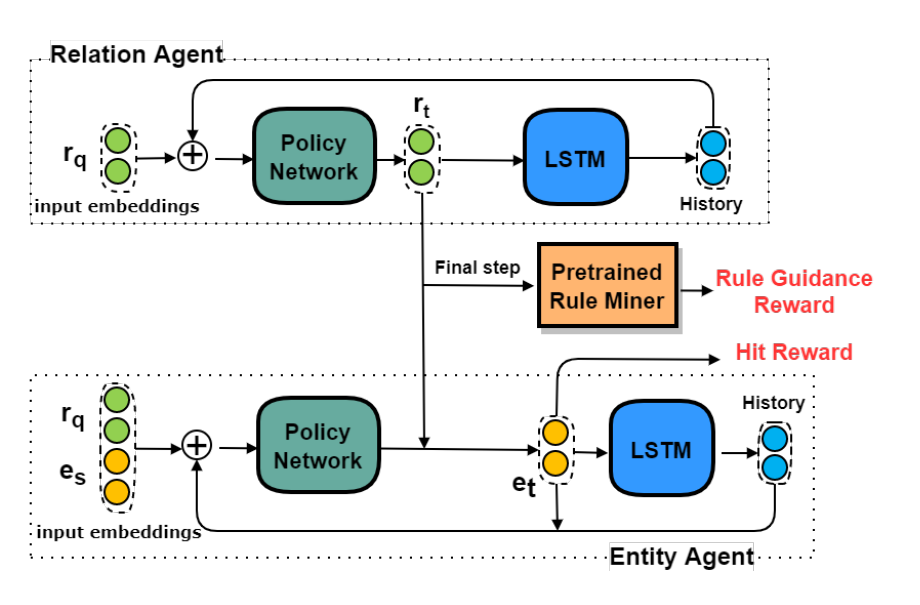
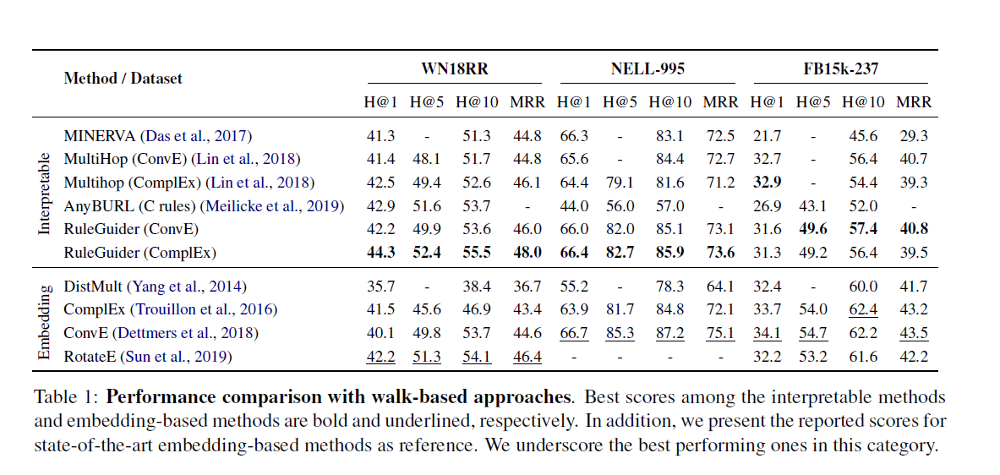

# 《Learning Collaborative Agents with Rule Guidance for Knowledge Graph Reasoning》

作者：D Lei, G Jiang, X Gu

**挑战：**

+ 遍历知识图谱提供的稀疏奖励信号通常不足以指导复杂的强化学习模型
+ 基于符号的推理方法虽然有良好的性能，从不同KG提取的规则可能具有不同的质量，这使得推理者难以选择规则。

**贡献：**

+ 本文提出一种结合规则的知识图谱多跳推理模型RuleGuider，其利用基于符号的方法生成的高质量规则为基于游走的智能体提供奖励

**模型**

两个代理的体系结构。 关系和实体代理相互交互以生成路径。 在每个步骤，实体代理首先从有效实体中选择一个实体。 然后，关系代理根据所选实体对关系进行抽样。 在最后一步，他们将根据最后选择的实体获得点击奖励，并根据选择的路径从预先挖掘的规则集中获得规则指导奖励。

**Relation Agent**

选择下一个关系：$r_t = P^R(r_q,e_{t-1},R,h_t^R)$

Pretrained Rule Miner模块中存在规则的先验分布。在relation agent 训练的过程中，首先基于Miner的先验分布来训练，同时还根据相应的语义信息来调整这个先验分布。

​	**Policy**

​	$h_t^R=LSTM(h_{t-1}^R ,r_{t-1})$ $r_{t-1} \in \R^d $ is the embedding of last relation

​	关系空间：$R_t \in \R^{|R_t|\times d}$ ，relation agent outputs a probability distribution $d_t^{R}$ and sample a relation form it $d_t^R = \sigma(R_t \times W_1RELU(W_2[h_t^R;r_q]));\ \sigma = softmax$,

**Entity Agent**

选择下一个实体：$e_t = P^E(e_s,r_q,r_t,R,h_t^E)$

​	**Policy**

​	$h_t^E = LSTM(h_{t-1}^E,e_{t-1})$ 

​	$d_t^E = \sigma(E_t\times W_3RELU(W_4[h_T^E;r_q;e_s;e_t]))$

**Experimental**

